# STM32F103C6T6 ve Arduino Uno ile SPI Haberleşmesi

    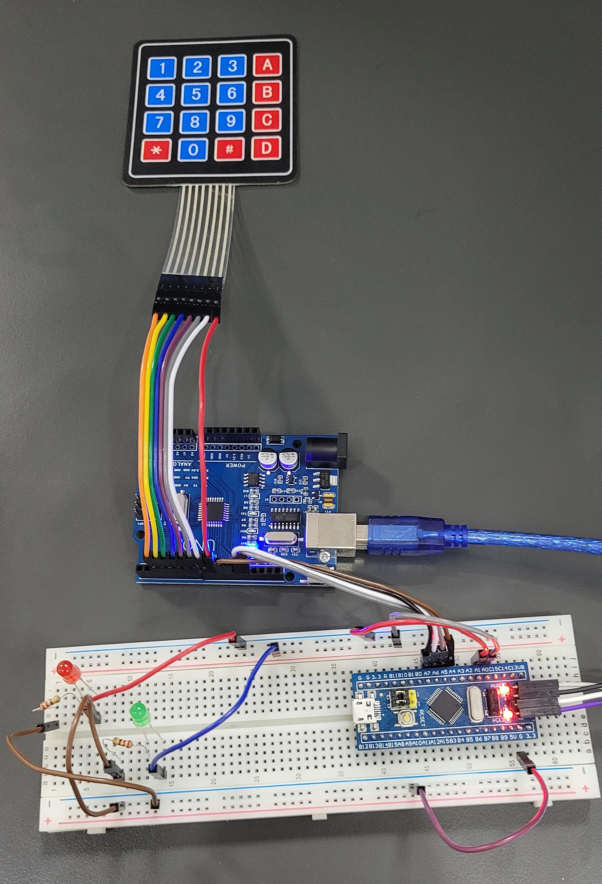
    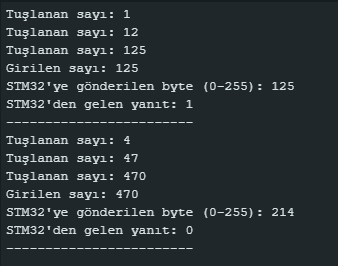

## Proje Açıklaması
Bu projede, bir Arduino Uno ile bir STM32F103C6T6 mikrodenetleyicisi arasında özel olarak yazılmış bir SPI protokolü kullanarak veri alışverişi gerçekleştirilmiştir. Arduino üzerindeki numpad aracılığıyla bir sayı girilir ve `#` tuşuna basıldığında bu sayı, SPI üzerinden STM32F103C6T6'ye gönderilir. STM32F103C6T6, sayının tek mi çift mi olduğunu belirler ve LED yakarak durumunu gösterir:

- **Yeşil LED** yanarsa sayı çifttir.
- **Kırmızı LED** yanarsa sayı tektir.

Ayrıca, STM32 bu sayıyı MISO hattı üzerinden tekrar Arduino'ya geri gönderir ve Arduino, alınan değeri seri terminalde gösterir.

## Kullanılan Bileşenler
- Arduino Uno
- STM32F103C6T6 Mikrodenetleyici
- ST-LINK V2
- 4x4 Numpad
- Yeşil ve Kırmızı LED
- Dirençler
- Bağlantı kabloları

## Çalışma Prensibi
1. Kullanıcı, Arduino üzerindeki numpad aracılığıyla bir sayı girer.
2. `#` tuşuna basıldığında, girilen sayı özel olarak yazılmış SPI protokolüyle STM32'ye gönderilir.
3. STM32, sayının tek mi çift mi olduğunu belirleyerek uygun LED'i yakar.
4. STM32, aldığı sayıyı MISO hattı üzerinden Arduino'ya geri gönderir.
5. Arduino, aldığı değeri seri terminale yazar.

## Devre Bağlantıları
### **Arduino Uno - STM32 SPI Pin Bağlantıları**
| Arduino Uno | STM32 |
|------------|-------|
| MOSI (11)  | PA7   |
| MISO (12)  | PA6   |
| SCK (13)   | PA5   |
| SS (10)    | PA4   |

### **LED Bağlantıları (STM32)**

| LED Renk  | STM32 Pin |
|-----------|----------|
| Yeşil LED | PA0      |
| Kırmızı LED | PA1    |

## STM32'ye Kod Yükleme (ST-Link V2)

STM32 mikrodenetleyicime **ST-Link V2** programlayıcısını kullanarak kod yükledim. 

### 1. HEX Dosyası Oluşturma  
- **STM32CubeIDE** içinde kod yazıp derleyerek **HEX** dosyasını oluşturdum.  

### 2. ST-Link V2 ile Bağlantı  
- ST-Link V2'yi bilgisayara bağladım.  
- **SWD pinlerini** STM32 ile uygun şekilde bağladım.  

### 3. STM32 ST-Link Utility ile Yükleme  
- **STM32 ST-Link Utility** programını açtım.  
- "Connect" ile mikrodenetleyiciyi tanıttım.  
- HEX dosyasını seçip **"Program & Verify"** ile STM32'ye yükledim.  

## STM32 kodunu build edip oluşan hex dosyasını  ST-Link ile STM32'ye kaydetme

    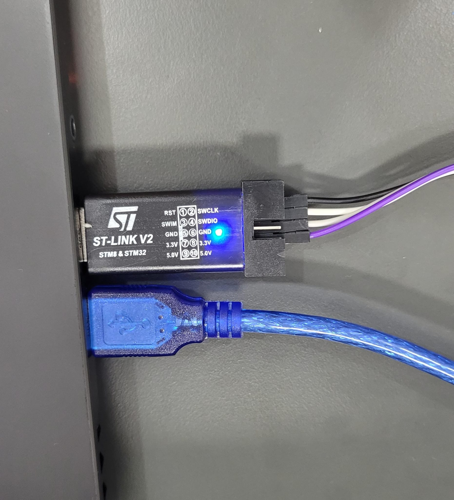
    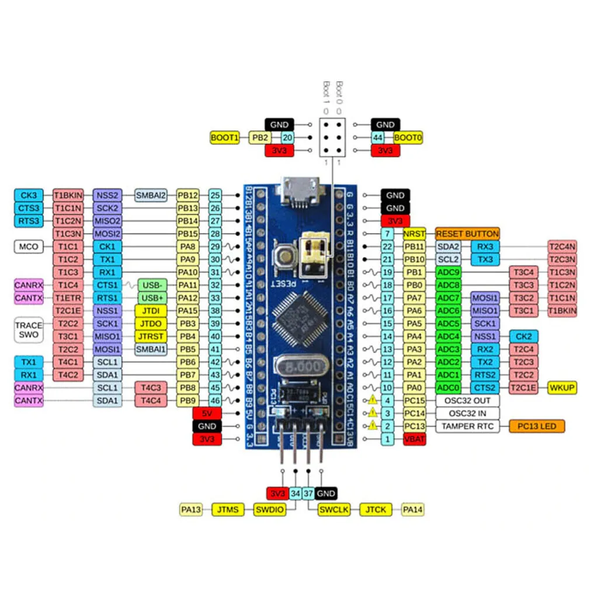
    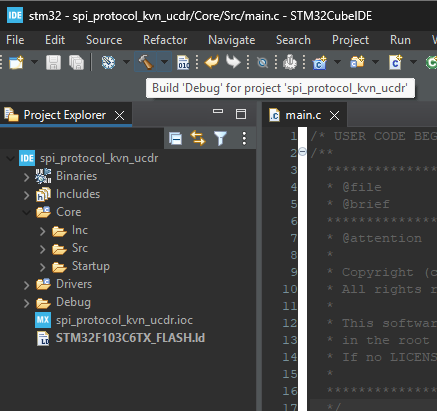
    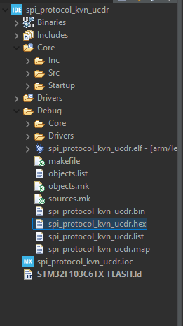
    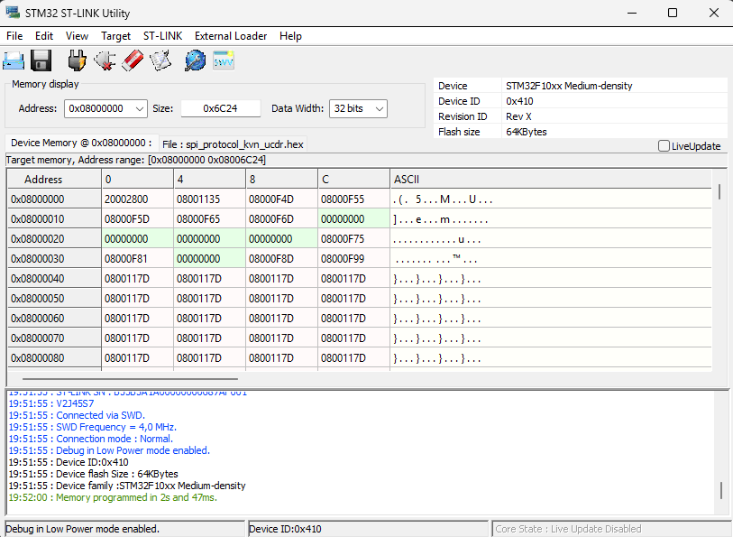
    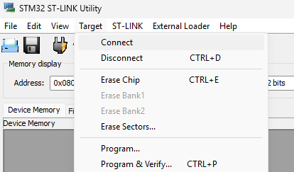
    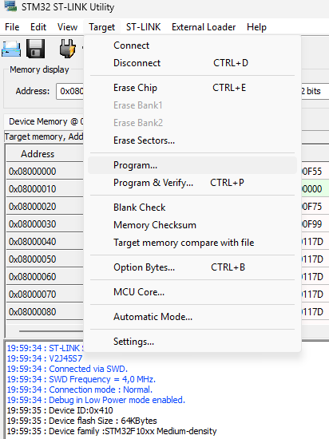
    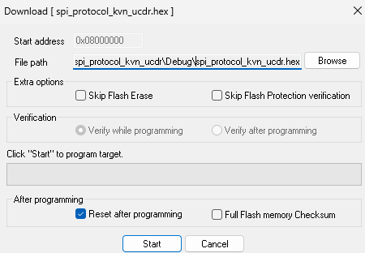
    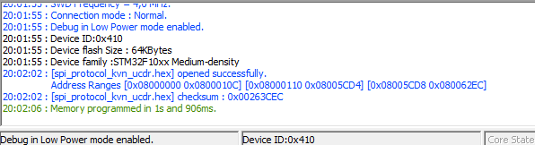

